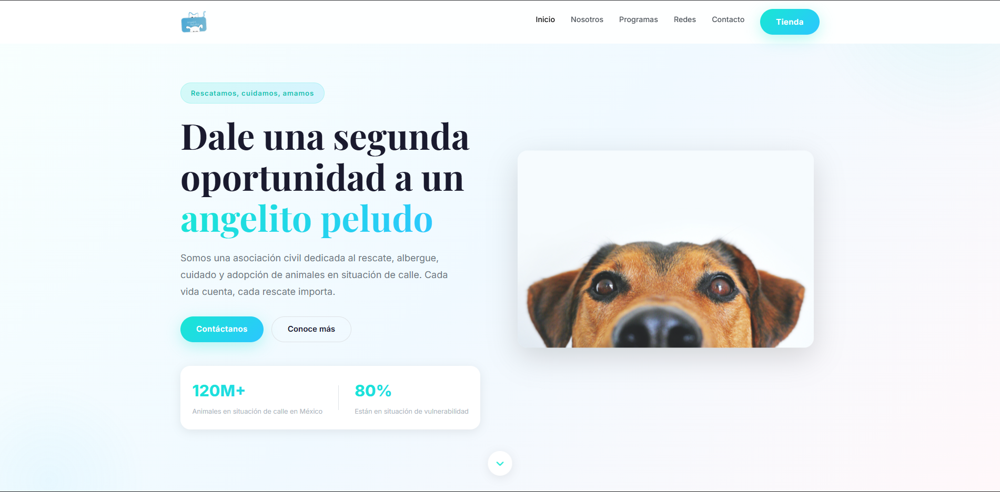
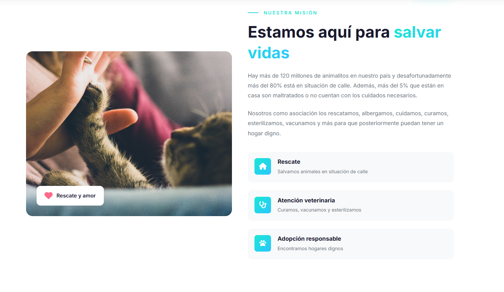
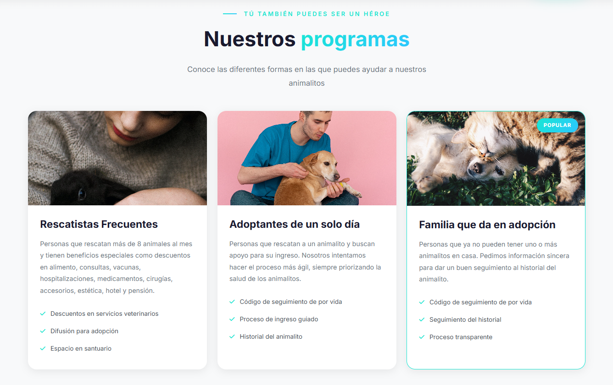
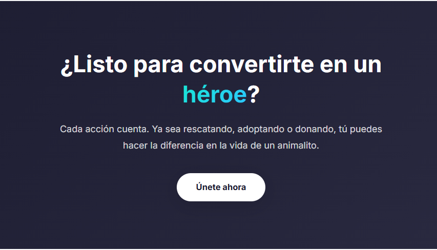
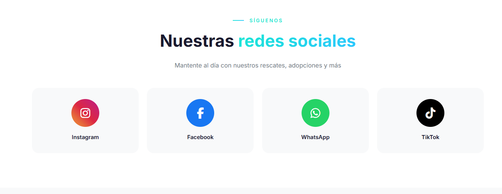
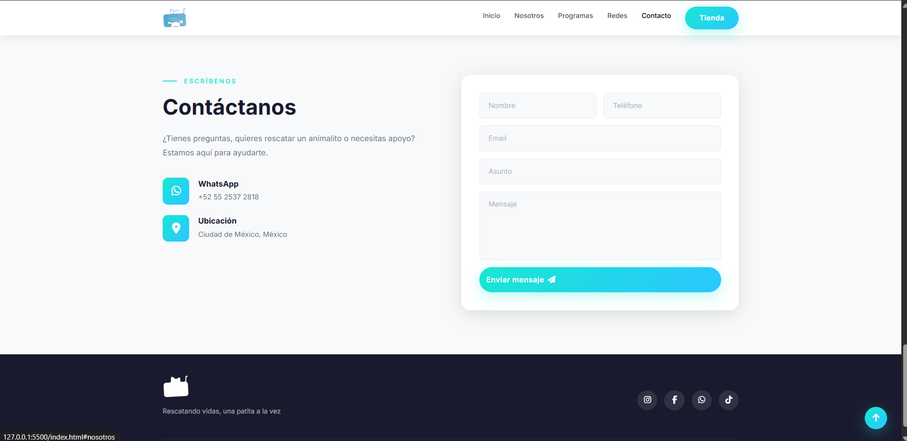

# Ángeles Peludos 🐾

Sitio web moderno para la asociación civil **Ángeles Peludos**, dedicada al rescate, cuidado y adopción de animales en situación de calle en México.

## 📋 Descripción

Este proyecto es el sitio web oficial de Ángeles Peludos A.C. La plataforma presenta información sobre la asociación, sus programas de rescate, formas de ayudar y canales de contacto.

## ✨ Características

- **Diseño moderno y limpio** con gradientes, animaciones y efectos visuales
- **Totalmente responsive** — se adapta a móviles, tablets y escritorio
- **Navbar con glassmorphism** que cambia al hacer scroll
- **Secciones organizadas**: Inicio, Nosotros, Programas, Redes Sociales y Contacto
- **Formulario de contacto** funcional con validación
- **Scroll suave** entre secciones
- **Animaciones de entrada** al hacer scroll (Intersection Observer)
- **Botón "back to top"** flotante

## 🛠️ Tecnologías

- HTML5
- CSS3 (Variables CSS, Flexbox, Grid, Animaciones)
- JavaScript (Vanilla)
- Bootstrap 5.3
- Font Awesome 6
- Google Fonts (Inter + Playfair Display)

## 📁 Estructura del Proyecto

```
Angeles Peludos/
├── index.html                          # Redirect al sitio
├── README.md                           # Documentación
├── DEFECTOS_CORREGIDOS.md              # Notas de correcciones
├── MEJORAS_ESTETICAS.md                # Notas de mejoras
├── imagenes-muestra/                   # Capturas de pantalla del sitio
│   ├── 1.png
│   ├── 2.png
│   ├── 3.png
│   ├── 4.png
│   ├── 5.png
│   └── 6.png
└── angeles-peludos.org/
    ├── index.html                      # Página principal
    ├── history.html                    # Página de historia
    ├── blog-details.html               # Página de detalles
    ├── css/
    │   ├── css/                        # CSS original
    │   └── modern.css                  # CSS moderno (nuevo)
    ├── js/
    │   ├── script.js                   # JS original
    │   └── modern.js                   # JS moderno (nuevo)
    ├── images/                         # Imágenes y assets
    ├── fonts/                          # Tipografías
    └── assets/                         # Assets adicionales
```

## 🚀 Cómo Usarlo

1. Clona el repositorio:
   ```bash
   git clone https://github.com/tu-usuario/angeles-peludos.git
   ```

2. Abre `angeles-peludos.org/index.html` en tu navegador o sirve el proyecto con un servidor local:
   ```bash
   # Con Python
   cd angeles-peludos/angeles-peludos.org
   python -m http.server 8000

   # Con Node.js
   npx serve angeles-peludos.org
   ```

3. Visita `http://localhost:8000`

## 📝 Secciones del Sitio

| Sección | Descripción |
|---------|-------------|
| **Inicio** | Hero con estadísticas y llamado a la acción |
| **Nosotros** | Misión, visión y servicios de la asociación |
| **Programas** | Rescatistas frecuentes, adoptantes y adopción |
| **Redes** | Links a Instagram, Facebook, WhatsApp y TikTok |
| **Contacto** | Formulario de contacto funcional |

## 📱 Capturas de Pantalla

| Vista | Captura |
|-------|---------|
| Hero / Inicio |  |
| Sección Nosotros |  |
| Programas |  |
| Unirte a nosotros |  |
| Redes Sociales |  |
| Footer |  |

## 🤝 Contribuir

1. Haz un fork del proyecto
2. Crea tu rama de feature (`git checkout -b feature/AmazingFeature`)
3. Haz commit de tus cambios (`git commit -m 'Add some AmazingFeature'`)
4. Push a la rama (`git push origin feature/AmazingFeature`)
5. Abre un Pull Request

## 📞 Contacto

- **WhatsApp**: [+52 55 2537 2818](https://wa.me/+525525372818)
- **Instagram**: [@_angelespeludos](https://www.instagram.com/_angelespeludos/)
- **Facebook**: [AngelesPeludosAC](https://www.facebook.com/AngelesPeludosAC/)
- **TikTok**: [@_angelespeludos](https://www.tiktok.com/@_angelespeludos)
- **Tienda**: [apshop.com.mx](https://www.apshop.com.mx/)

## 📄 Licencia

Este proyecto es para uso de la asociación civil Ángeles Peludos.

---

Hecho con ❤️ para los animalitos de México
